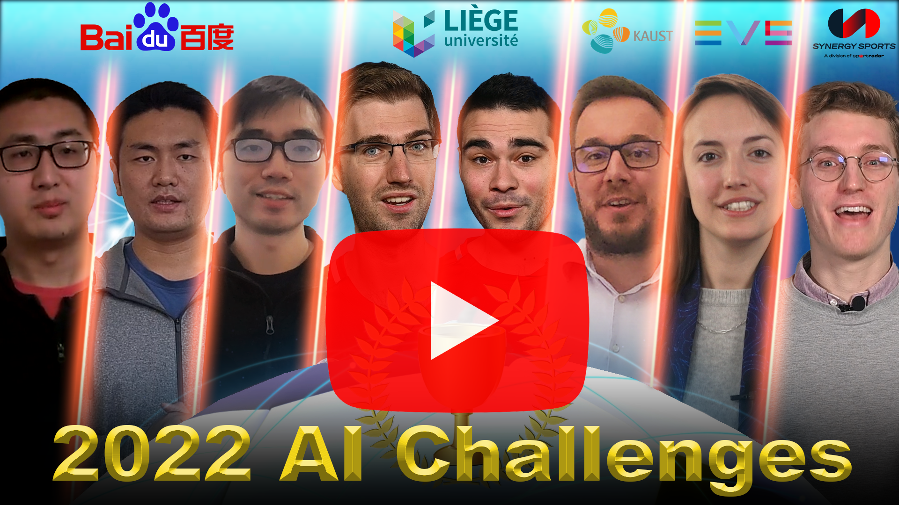

&nbsp;


# Soccer Player Re-Identification 
Welcome to the Development Kit and Dataset for the SoccerNet Re-Identification Task and Challenge.
This kit is meant as a help to get started working with the SoccerNet data and the proposed task.
In this task, participants will have to re-identify soccer players across multiple camera viewpoints.
More general information about the SoccerNet dataset can be found on our [official website](https://www.soccer-net.org/).
In this repository, you will find all the instructions and codebase for participating in this challenge and get a chance to win the 1000$ prize money!
The winner of the competition will be announced in June 2023.

&nbsp;
<p align="center"></p>
&nbsp;

SoccerNet Re-Identification (ReID) is part of the SoccerNet-v3 dataset, which is an extension of SoccerNet-v2 with new and challenging tasks including 
action spotting, camera shot segmentation with boundary detection, replay grounding, calibration, multi-view player re-identification and multi-player tracking.
The participation deadline is fixed at the 25th of May 2023.
The official rules and guidelines are available on [ChallengeRules.md](ChallengeRules.md).


Make sure to watch our announcement video on Youtube:

&nbsp;
<a href="https://youtu.be/tA9E1hkiyB0">
<p align="center"></p>
</a>

 
     

   
  

&nbsp;


&nbsp;


### Dataset structure
ReID samples are organized following the original SoccerNet dataset structure.
The Soccernet-v3 ReID dataset is thus organized within a tree folder structure :

`root` -> `{train, valid, test, challenge}` -> `championship` -> `season` -> `game` -> `action` -> `image files`

Each action contains a set of samples, which are images files of players or referees cropped from the original Soccernet-v3 dataset using the bounding boxes annotations.
Annotations for each sample are provided within the filename, as described in the next section.


### Evaluation
Similar to standard ReID datasets, each valid/test/challenge set is split into two subsets: query and gallery.
Query samples are bounding boxes from action frames with at least one match in the replay frames.
Gallery samples are bounding boxes from replay frames, or bounding boxes from action frames with no match.
For each query, we compute a ranking of gallery samples **from the same action** and compute corresponding ranking performance: rank-1 and average precision.
Query sample are therefore only matched against gallery samples from the same action. 
This is different from classic street surveillance ReID datasets, where query samples are only matched against gallery samples from different camera viewpoints. 
Our process for building the query/gallery split is illustrated in the next figure.

&nbsp;
<p align="center"></p>

## Instructions
This repo is a fork of the [Torchreid](https://github.com/KaiyangZhou/deep-person-reid) framework for person re-identification.
Make sure to have a look at the original [Torchreid Readme](TORCHREID_README.rst) and the official [Torchreid documentation](https://kaiyangzhou.github.io/deep-person-reid/.) for detailed how-to instructions.

### How to install the SoccerNet ReID development kit
For installation guidelines, we adapt the instructions from the original [Torchreid Readme](TORCHREID_README.rst) :

First, make sure [conda](https://www.anaconda.com/distribution/) is installed.

```
    # cd to your preferred directory and clone this repo
    git clone https://github.com/SoccerNet/sn-reid.git

    # create environment
    cd sn-reid/
    conda create --name sn-reid python=3.7
    conda activate sn-reid

    # install dependencies
    # make sure `which python` and `which pip` point to the correct path
    pip install -r requirements.txt

    # install torch and torchvision (select the proper cuda version to suit your machine)
    conda install pytorch torchvision cudatoolkit=9.0 -c pytorch

    # install torchreid (don't need to re-build it if you modify the source code)
    python setup.py develop
```

### How to train and test a baseline model
We provide a basic script in [benchmarks/baseline](benchmarks/baseline) for training a baseline model on the Soccernet-v3 training set, evaluate rank-1 and mAP performance on the Soccernet-v3
validation and test set, and finally export ranking results on the Soccernet-v3 challenge set for external evaluation.

To train the baseline model, run:

```
python benchmarks/baseline/main.py --config-file benchmarks/baseline/configs/baseline_config.yaml
```

Running this script will automatically download the dataset in the folder specified by the `data.root` config.

Have a look at the YAML configuration file [baseline_config.yaml](benchmarks/baseline/configs/baseline_config.yaml) and related default configuration [default_config.py](benchmarks/baseline/default_config.py) for more information about the available options.

### How to manually download the dataset
The SoccerNet ReID dataset is automatically downloaded and extracted by Torchreid upon first usage, 
but you can still use the [SoccerNet pip package](https://pypi.org/project/SoccerNet/) to easily download the data and annotations manually. 

To install the pip package simply run:

```
pip install SoccerNet
```

Then use the API to download the data of interest:

```
from SoccerNet.Downloader import SoccerNetDownloader
mySoccerNetDownloader = SoccerNetDownloader(LocalDirectory="/path/to/project/datasets/soccernetv3")
mySoccerNetDownloader.downloadDataTask(task="reid", split=["train", "valid", "test", "challenge"])
```

This will download four zip files under `/path/to/project/datasets/soccernetv3/reid/{train.zip, valid.zip, test.zip, challenge.zip}`.
Unzip these four zip files and put four resulting folders under the same path, i.e. `/path/to/project/datasets/soccernetv3/reid/{train, valid, test, challenge}`.
The Torchreid config `data.root` should then point to `/path/to/project/datasets` or simply `datasets`, the framework will then look for the four sets under `/path/to/project/datasets/soccernetv3/reid/`.
In above instructions, replace `/path/to/project/datasets` by any path of your choice, but keep the `soccernetv3/reid/{train, valid, test, challenge}` folder structure.

For further information, have a look at [soccernetv3.py](torchreid/data/datasets/image/soccernetv3.py)).

| Dataset       | Size |
| ---           |  ---    |
| train.zip     | 12.12 GB
| valid.zip     | 2.35 GB
| test.zip      | 2.41 GB
| challenge.zip | 1.75 GB

### How to export your ranking results for the challenge set
Enable the `test.export_ranking_results` config in [default_config.py](benchmarks/baseline/default_config.py) or [baseline_config.yaml](benchmarks/baseline/configs/baseline_config.yaml) 
to export all ranking results for each target dataset. 
Ranking results will be exported to a JSON file `ranking_results_***.json` in the directory specified by the `data.save_dir` config.

To export ranking results for the SoccerNet ReID challenge set, make sure to add `'soccernetv3_challenge'` to the list of target datasets in the `data.targets` config.

### How to test the exported ranking results locally
To evaluate locally the ranking performance on the exported `ranking_results_***.json`, you can use the [evaluation script](tools/evaluate_soccernetv3_reid.py) provided in the tools directory:

```
python tools/evaluate_soccernetv3_reid.py -rs ranking_results_***.json -gt /path/to/project/datasets/soccernetv3/reid/test/test_bbox_info.json
```

For that purpose, you'll need to provide the location of the corresponding ground truth file, i.e. `test_bbox_info.json` for the test set, which is part of the dataset you downloaded before.
Make sure to use the correct ground truth file (valid or test) with respect to the set on which the ranking result file was computed.
Exported ranking results cannot be evaluated locally for the challenge set because the corresponding ground truth file is kept private from the participants. 


## Future improvements
This repository will be actively maintained during the course of the challenge, make sure to subscribe and come back frequently to get the latest updates!
Here are some of the things we plan to add or improve:
- Some stats about the dataset size.
- Faster ranking script in rank.py to assess model performance.


